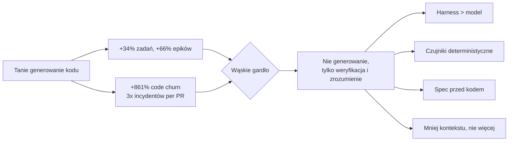
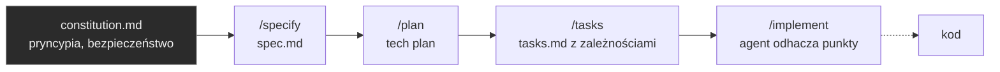
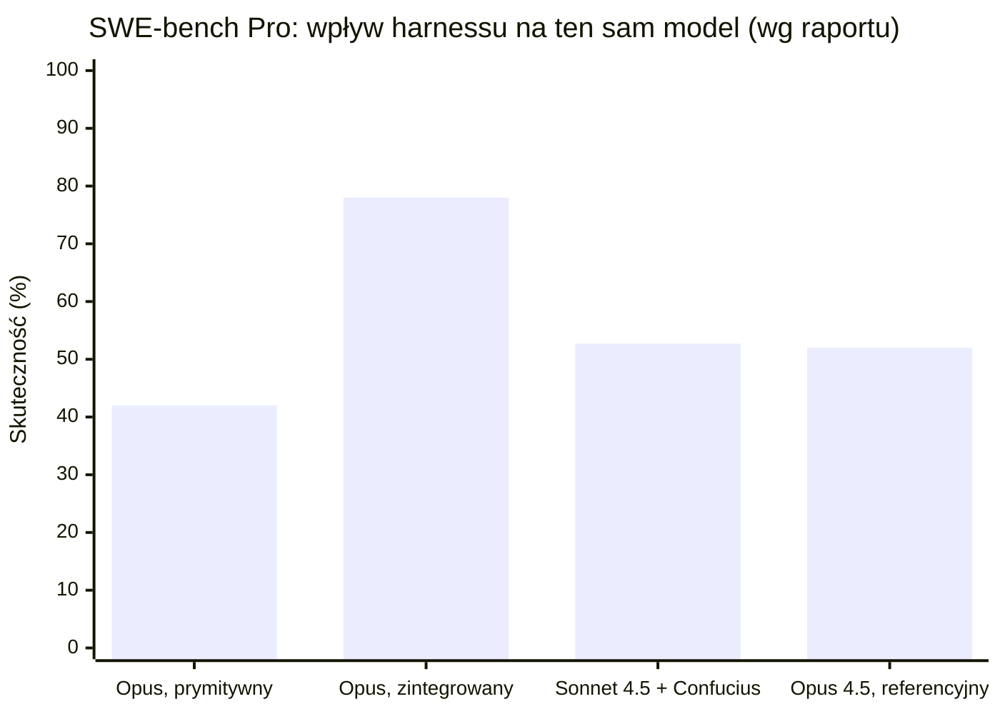
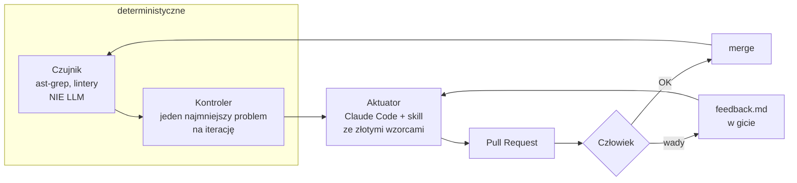
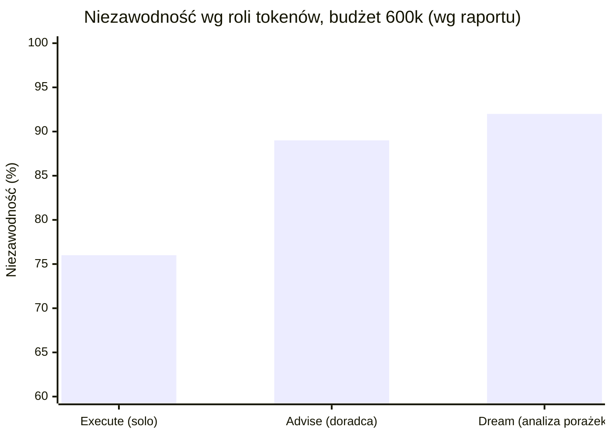
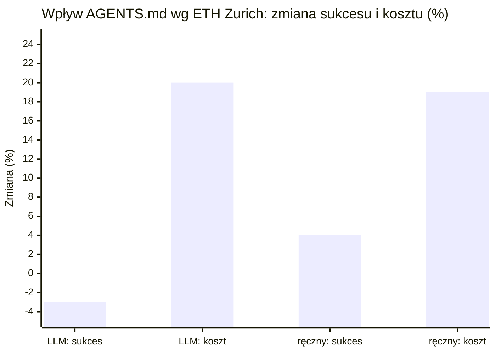
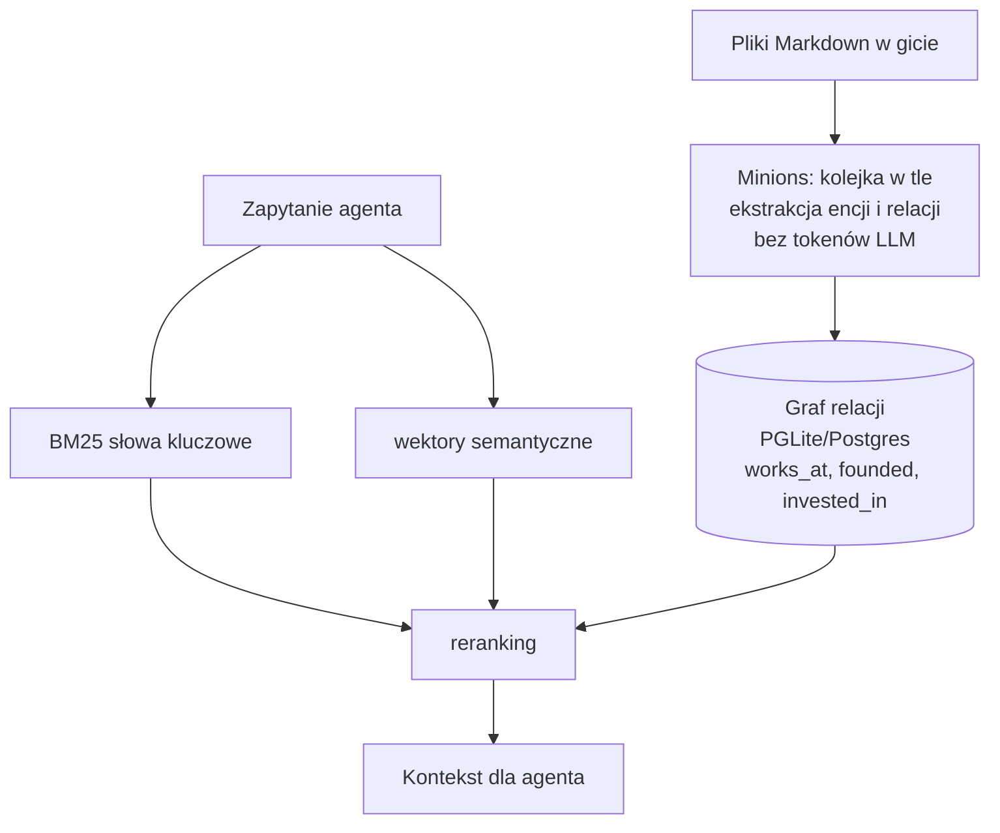
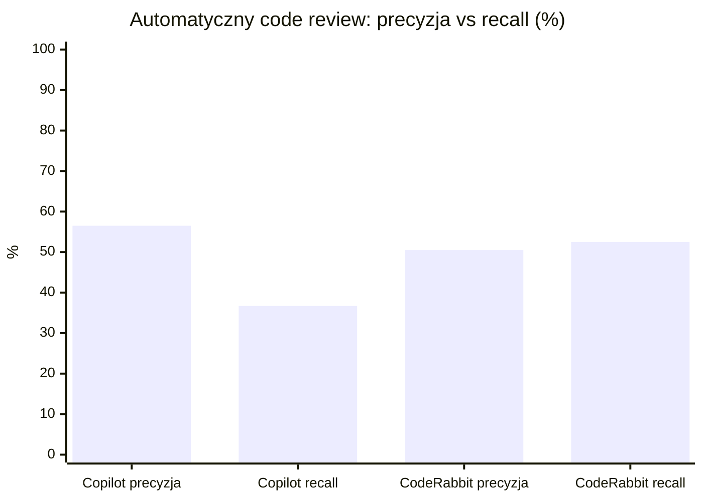
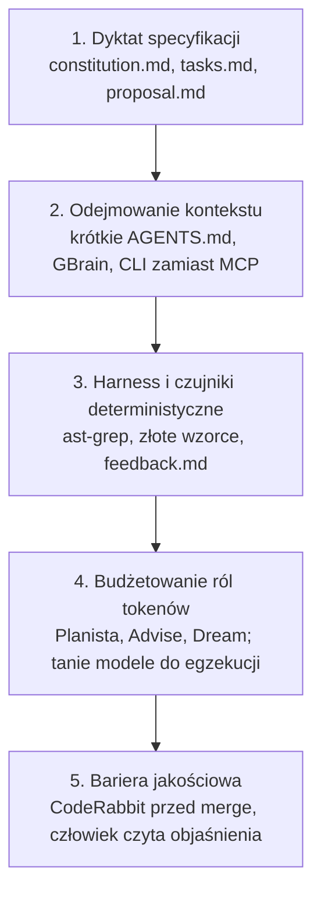

# Workflow solo dewelopera z agentami kodującymi: raport zwiadowczy (Gemini Deep Research)

> [!info] Czym jest ten plik
> Przeformatowana wersja surowego raportu z `research/reports/`. Treść i liczby pochodzą z raportu, struktura, diagramy i wykresy są moje. Numery w nawiasach kwadratowych to numery źródeł z listy na końcu. Sekcja **Ocena** na końcu jest moja i nie należy do raportu.

## 1. Teza raportu w jednym obrazie

> [!quote] Dane wejściowe (Faros AI, „Acceleration Whiplash" 2026, telemetria 22 000 deweloperów) [5][6][7]
> - zadania domknięte per deweloper: **+33,7%**, epiki: **+66,2%**
> - code churn: **+861%**, incydenty produkcyjne per PR: **ponad 3x**
> - zmiany na produkcji bez ludzkiej weryfikacji: **+31%**

## 2. Kompletne frameworki i Spec-Driven Development

### BMAD-METHOD [9][10][12]

- Ponad 43 tys. gwiazdek na GitHub pod koniec 2026.
- Zamiast jednego wszechwiedzącego agenta: sieć sub-agentów w rolach scrumowych (Analityk, PM, Architekt, Scrum Master, Dev). Każdy ładuje tylko potrzebne mu szablony i wycinki bazy wiedzy.
- v7 (połowa 2026) dodaje dwa mechanizmy przeciw potakiwaniu modelu:
  - **party-mode „anti-consensus club"**: persony Wildcard, Level, Killjoy, Splinter podważają architekturę, aż zostanie obroniona;
  - **Edge Case Hunter**: szuka „cichych gałęzi", czyli obsługi tylko części wartości enum, flag, kodów statusu. Raport podaje wzrost wykrywalności regresji „od 50% do 100%" `[do weryfikacji]`.

### Spec Kit (GitHub/Microsoft) i OpenSpec [13][14][15][16]

- **Spec Kit**: CLI `specify` stawia rusztowanie, potem kaskada komend w Claude Code lub Cursor. Reguły (accessibility, design system) są w specu od początku, nie jako łatka.
- **OpenSpec**: brownfield-first, dla istniejących dużych systemów. Specyfikacje delta w katalogach zmian (`proposal.md`, `design.md`), oddzielone komendy powłoki od akcji w czacie.
- Jonathan Gordon (ReWeaver AI, WF2026): pełny roundtrip design ↔ kod pozostaje niespełniony; bez deterministycznych barier intencje projektowe zacierają się w kodzie [19].

### Agent OS v3: redukcja o 70% [20][21][22]

- Styczeń 2026: usunięto 70% kodu frameworka. Zarządzanie cyklem życia agenta oddano Claude Code.
- Zostało jedno zadanie: ekstrakcja standardów z bazy kodu i wstrzykiwanie ich modelowi przy tworzeniu specu.
- Założenie autorów: optymalizację pętli wykonawczej wygrali dostawcy harnessów, framework nie ma tam czego szukać.

## 3. Harness engineering: otoczka ważniejsza niż model

> [!quote] SWE-bench Pro, ten sam model, różne otoczenie [24]
> Claude Opus w prymitywnym środowisku: **42%**. Ten sam model w zintegrowanym harnessie: **78%**.
> Confucius Code Agent (Meta + Harvard): Claude Sonnet 4.5 w zoptymalizowanym harnessie **52,7%** vs Claude Opus 4.5 w referencyjnym **52,0%**.

| Wariant | Zastosowanie | Narzędzie | Wynik (wg raportu) |
|---|---|---|---|
| Głębokie rozumowanie architektoniczne | duże refaktoryzacje, długie specyfikacje | Claude Code (Opus 5) | ~79% SWE-bench Pro [28] |
| Błyskawiczna iteracja w IDE | codzienne zmiany wieloplikowe, pod nadzorem | Cursor (Composer 2.5) | 62 pkt Artificial Analysis [4] |
| Surowa egzekucja w terminalu | deployment, bash, infrastruktura | OpenAI Codex (GPT-5.5) | 82,7% Terminal-Bench 2.0 [4] |

Simon Willison: model to jądro nowego systemu operacyjnego, harness to uprawnienia, planista i pamięć [25].

## 4. Anatomia pętli: Great Loops Debate i teoria sterowania

### Upadek „ślepych pętli" (wzorzec Ralpha) [29][30]

- Jeff Huntley: skrypt bash, agent pisze, testuje i merguje sam. Na prostych zadaniach pozornie 10x szybciej.
- Dex Horthy i Kyle Mistele (HumanLayer): PR-y do **40 000 linii**, których nikt nie zweryfikuje.
- Agenci trenowani RL mają za funkcję nagrody przejście testów, nie architekturę: null pointer naprawiany przez owinięcie w `try/catch`.

### Pętla jako układ sterowania (Kyle Mistele) [30]

> [!important] Cztery reguły z tej pętli
> 1. **Czujnik nigdy nie jest LLM-em.** Modele źle liczą i źle wykrywają drobne anomalie w dużym tekście.
> 2. **Kontroler minimalizuje blast radius.** Jeden problem na iterację, najkrótszy w liniach.
> 3. **Aktuator dostaje złote wzorce.** Modele replikują styl lepiej, niż wymyślają go z pustych instrukcji.
> 4. **Człowiek nie poprawia kodu ręcznie.** Pisze instrukcję do `feedback.md`, agent poprawia.

## 5. Ekonomia tokenów: „Tokens Should Have Jobs" (Anthropic, WF2026) [31][32][33]

Budżet sztywno 600 000 tokenów, zadania z tolerancją tylko bezbłędnych rozwiązań.

| Rola | Mechanizm | Wynik | Uwaga |
|---|---|---|---|
| Execute | samotny wykonawca od początku do końca | 76% | baza |
| Grade | osobny oceniacz z rubryką odrzuca i wymusza poprawki | „podniosła poprawność" | brak liczby w raporcie; wymaga precyzyjnych specyfikacji |
| Advise | wykonawca odpytuje wyspecjalizowanego doradcę | 89% | najbardziej opłacalna przy sztywnym limicie |
| Dream | sub-agent analizuje transkrypty porażek i zapisuje wnioski do pamięci | 92% | najwyższy narzut kosztu |

> [!tip] Dyrektywa raportu
> Tokeny nie są jednorodnym kapitałem. Okno kontekstowe wymaga routingu: inne role dla ewaluacji, inne dla abstrakcji, inne dla egzekucji.

## 6. Zarządzanie wiedzą: „iluzja AGENTS.md", MCP, GBrain

### Badanie ETH Zurich (Gloaguen i in., luty 2026) [37][39][40][41]

> [!warning] To uderza wprost w DOX
> Setki realnych zadań agentowych. Pliki `AGENTS.md`:
> - **generowane przez LLM**: sukces **−3%**, koszt inferencji **+20%**;
> - **pisane ręcznie**: sukces **+4%**, koszt **+19%**.
>
> Mechanizm: agent w repo pełnym instrukcji wpada w nadmierną eksplorację (przeszukiwanie plików, próby kompilacji, liczenie testów), tokeny rozumowania +14% do +22%, o 2,45 do 3,92 zbędnych kroków na zadanie więcej.

Wniosek raportu: w dobrze ułożonym repo obszerny plik kontekstowy to szum. Pisać **wyłącznie** to, czego nie da się wydedukować ze struktury plików.

### MCP i koszt schematów (Nikita Kotari, Salesforce, WF2026) [42][43]

- „Dumb Zone": raport podaje próg około **40% nasycenia** okna kontekstowego, po którym spada precyzja `[do weryfikacji]` [34].
- 50 narzędzi MCP = **15 000 do 20 000 tokenów** samych schematów, do **60%** roboczego okna przed pierwszym krokiem.
- Reguła: jeśli da się zrobić przez CLI, robić przez CLI. MCP i tokeny LLM tylko do operacji semantycznych.

### GBrain (Garry Tan, kwiecień 2026) [44][45][46][47]

- Korpus ok. 146 000 stron: precision@5 z **18% do ~49%** (+31,4 pkt) względem czystego wyszukiwania wektorowego.
- Deterministyczna ekstrakcja bez LLM to odpowiedź na „zawodne RAG".

## 7. Weryfikacja: „Comprehension Debt" i automatyczny code review

- **Comprehension Debt** (Faros AI): luka między objętością i zawiłością systemu a wiedzą deweloperów zdolnych go pojąć [49].
- Telemetria: 3x więcej problemów w review (cicha duplikacja, maskujące wyjątki), błędy logiczne **+75%** [6].
- Veracode 2026: w **44%** zadań AI wstrzykuje znaną lukę bezpieczeństwa; modele „do kodowania" nie są lepsze od ogólnych [28].

### CodeRabbit vs GitHub Copilot Code Review [50][51]

| Narzędzie | Precision | Recall | F1 | Charakter |
|---|---|---|---|---|
| GitHub Copilot Code Review | 56,5% | 36,7% | – | zachowawczy, przepuszcza 2 z 3 wad |
| CodeRabbit | 50,5% | 52,5% | 51,5% | agresywny, więcej szumu, 40+ linterów i SAST przed LLM |

> [!important] Asymetria weryfikacji
> Jeśli kod pisze system stochastyczny, pierwszą warstwą weryfikacji nie może być inny system stochastyczny. Najpierw analiza statyczna i testy kontraktowe, LLM na końcu.

## 8. Synteza raportu: pięć filarów

## 9. Artefakty raportu

### Artefakt A: mapa obszaru (wg raportu)

| Komponent | Problem | Dominujący wzorzec 2026 | Narzędzia referencyjne |
|---|---|---|---|
| Planowanie i routing | dryf architektury, PR-y na tysiące linii, vibe coding | SDD, wstrzykiwanie ról, listy zadań w markdown, anti-consensus | BMAD v7, Agent OS v3, Spec Kit, OpenSpec |
| Pętla egzekucyjna | ślepa pętla Ralpha, degradacja przez testy jako nagrodę | teoria sterowania: czujnik → kontroler → aktuator | HumanLayer, ast-grep, BEADS + Metaswarm, Archon |
| Budżet tokenów | marnowanie okna na schematy narzędzi, Dumb Zone | routing ról, CLI przed MCP | Execute/Advise/Grade/Dream |
| Pamięć i wiedza | toksyczny nadmiar instrukcji (paradoks AGENTS.md) | graf w markdown pod Postgresem bez LLM | GBrain, E2B Sandboxes |
| Weryfikacja / ACR | Comprehension Debt, churn +861% | kaskada: lintery i SAST przed LLM | CodeRabbit, Copilot Code Review, Cursor Bugbot |

### Artefakt B: luki i sprzeczności (wg raportu)

1. **AGENTS.md: dostawcy vs ETH Zurich.** Vendorzy forsują pliki kontekstowe, badanie pokazuje −3% sukcesu i +20% kosztu dla generowanych, +4% i +19% dla ręcznych.
2. **Prędkość vs utrzymywalność.** +30% przepustowości i +861% churn w tym samym zbiorze danych; zysk z kodowania ginie w naprawach.
3. **SWE-bench mierzy end-to-end**, nie degradację wewnętrzną; zielone testy maskują duplikaty i owinięte wyjątki.
4. **MCP vs okno kontekstowe.** ~20 000 tokenów schematów na start zmusza do wyboru CLI.

### Artefakt C: kierunki do pogłębienia (wg raportu)

1. Hybrydowa ewaluacja: co oddać analizatorom deterministycznym (AST), a co zostawić LLM.
2. Zarządzanie Comprehension Debt: podsumowania semantyczne i wymuszanie uproszczeń przed kodowaniem.
3. Typowany graf pamięci w gicie (na wzór GBrain) vs czysty RAG wektorowy.
4. Rentowność routingu ról sub-agentów (Tokens Should Have Jobs) vs jeden monolityczny agent.

## Źródła

Pełna lista 53 pozycji w surowym raporcie. Najważniejsze pierwotne:

- [5] Faros AI, „The AI Engineering Report 2026: The AI Acceleration Whiplash"
- [12] BMAD-METHOD CHANGELOG (GitHub)
- [13][14] GitHub blog i Microsoft Developer o Spec Kit
- [22] buildermethods/agent-os (GitHub)
- [24] particula.tech, „SWE-Bench 2026: Scaffolding Moves 22 Points, Models Move 1"
- [29][30] Dex Horthy i Kyle Mistele, HumanLayer, WF2026 (streszczenia podcastów BigGo)
- [33] „Tokens Should Have Jobs", Katelyn Lesse i Angela Jiang, Anthropic (YouTube)
- [40] arXiv 2602.11988, „Evaluating AGENTS.md: Are Repository-Level Context Files Helpful"
- [43] Stephanie Jarmak, „Most of the agent bill is input tokens" (WF2026)
- [44] Slite, „GBrain, reviewed"
- [51] Morph, „CodeRabbit vs GitHub Copilot Code Review (2026)"

---

## Ocena

> [!note] Ta sekcja jest moja, nie pochodzi z raportu.

### Co raport robi dobrze

- **Trzy twarde źródła, które zmieniają nasze założenia:** badanie ETH Zurich o AGENTS.md, dane Anthropic o rolach tokenów, telemetria Faros AI. Każde wymaga przeczytania w oryginale, ale każde jest konkretne i cytowalne.
- **Potwierdza sygnały z triage'u wideo** niezależnymi źródłami: harness ważniejszy niż model, czujnik nie jest LLM-em, CLI przed MCP, człowiek czyta kod. Nic z wideo nie zostało obalone.
- **Agent OS v3** jako precedens: framework, który wyciął 70% siebie, bo pętlę wykonawczą przejął Claude Code. To argument za naszym „nie budujemy harnessu".

### Co jest słabe

- **Nie odpowiedział na pytania analityczne.** Brak osobnej sekcji, brak odpowiedzi na pytanie o trzy warstwy (kontrakt, kierunek, stan), brak listy „kto niezależnie potwierdza dany element". To był jawny wymóg promptu i planu.
- **Punkty 4 i 8 zakresu prawie nieobecne.** Warstwa specyfikacji to tylko Spec Kit; brak grill-me, pionowych plastrów, prototypów. Skala minimalizmu nie ma własnej sekcji, choć była w planie jako (8).
- **Artefakty nie trzymają schematu.** Tabela A nie ma kolumn dojrzałość i koszt wejścia. Artefakt B to narracja, nie źródła po obu stronach. Artefakt C to cztery programy badawcze na lata, nie 3–5 pytań decyzyjnych z uzasadnieniem, dlaczego zwiad nie wystarczył.
- **Styl.** Ściany tekstu, przymiotniki („rewolucyjne", „kategorycznie", „bezkompromisowo"), powtórzenia. Persona „architekt procesów" nie zadziałała na ton.
- **Źródła mieszanej jakości.** Obok arXiv i raportów firm są blogi SEO (thesys, taskade, firecrawl, secondtalent) i streszczenia podcastów zamiast nagrań. Kilka liczb bez pierwotnego źródła: próg 40% Dumb Zone, „50% do 100%" dla Edge Case Hunter, wynik Grade bez wartości.
- **Reguła „liczba ze źródłem albo brak danych" nie zadziałała** mimo wpisania jej w plan.

### Co z tego wynika dla projektu

1. **Badanie ETH to pierwszy kierunek pogłębienia**, bo dotyka DOX wprost. Pytanie decyzyjne: czy hierarchia AGENTS.md w aid4u jest bliżej „ręcznie pisanego minimum" (+4%) czy „generowanego szumu" (−3%)? Trzeba przeczytać arXiv 2602.11988 i zmierzyć, ile tokenów ładuje nasz chain.
2. **Kolejność weryfikacji w pętli** jest już ustalona przez pięć niezależnych źródeł: lintery i testy, potem osobny agent, potem człowiek. Nie wymaga dalszego researchu, wymaga wdrożenia.
3. **Audyt docker-mcp-toolkit** ma gotowe kryterium (CLI vs MCP, koszt schematów). Też wdrożenie, nie research.
4. **Nieodrobione punkty** (specyfikacja, minimalizm, trzy warstwy) idą do osobnego, wąskiego przebiegu. Claude Research, nie Gemini, bo pytanie jest wąskie.
5. **Dla DR GEM:** persona bez wpływu na ton, artefakty ze schematem ignorowanym, reguła o liczbach zgubiona. Trzy obserwacje do zapisania na Dysku.
