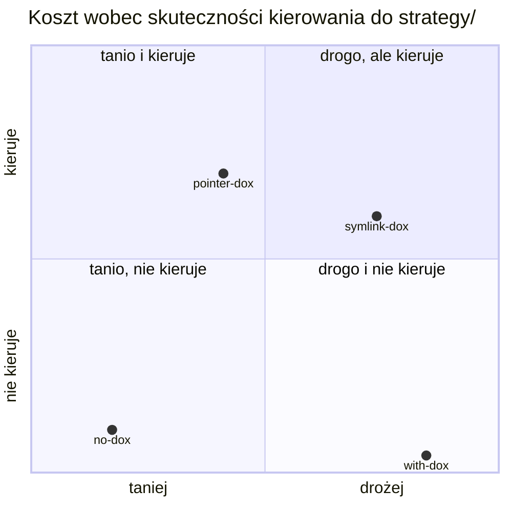

# Pomiar: wpływ chaina AGENTS.md na Claude Code w aid4u (zadanie s01e02)

- Wersja interaktywna rundy 2 (wykresy z tooltipami, pełna tabela): artefakt „Chain DOX pod pomiarem”, `https://claude.ai/artifact/2SBcmGfKPUZortLKbHBS6t` — prywatny, dostępny dla właściciela.
- Środowisko i skrypty: `bench/aid4u-dox/README.md`. **Surowe transkrypty nie są w repo** (`results/` jest gitignored, kopia w `02_aid4u-bench/_results-backup/`), więc ta nota jest jedynym trwałym zapisem pomiaru.
- Metoda: `claude -p` (pełny Claude Code w trybie nieinteraktywnym), model Sonnet, ten sam prompt, świeży snapshot repo bez historii gita i bez śladów rozwiązania. Globalny `~/.claude/CLAUDE.md` (708 tokenów) obecny we wszystkich wariantach.
- **Koszt jest hipotetyczny.** Maszyna loguje się subskrypcją (`claudeAiOauth`, brak `ANTHROPIC_API_KEY`), więc `total_cost_usd` ze `stream-json` to wycena po cenniku API, nie wydatek. Jako miara porównawcza zużycia tokenów jest ważna, jako kwota — nie.
- **Dwie rundy, nieporównywalne wprost.** Runda 1 (n=3) miała wadę: `git clean -fd` nie usuwał ignorowanych `.cache/` i `data/run-history/`, więc przebiegi 2 i 3 każdego wariantu startowały z danymi pobranymi przez przebieg 1. Runda 2 (n=10) idzie w całości na zimno po naprawie (`git clean -fdx`). Liczb z obu rund nie zestawiam na jednym wykresie.

## Treść

### Warianty

| Wariant | Chain do `tasks/s01e02_findhim` | Mechanizm | Runda |
|---|---|---|---|
| `with-dox` | 11 946 | aid4u jak jest | 1, 2 |
| `no-dox` | 708 | żadnego `AGENTS.md`/`CLAUDE.md` w repo | 1, 2 |
| `clean-dox` | 4 107 | root i `tasks/AGENTS.md` przycięte do reguły ETH | 1 |
| `strategy-dox` | 4 217 | `clean-dox` plus **nakaz** czytania `strategy/` w Read Before Editing | 1 |
| `pointer-dox` | 4 797 | `clean-dox` plus **tabela wskaźników**: nazwa, plik, gdzie wiążące, kiedy stosować | 2 |
| `symlink-dox` | 4 151 | `clean-dox` plus **symlinki** `*_strategy.md` w 33 folderach (w tym `rules_strategy.md`) **oraz krok 5**, który każe je wylistować i przeczytać — dwa zabiegi naraz | 2 |

### Runda 2: cztery warianty po dziesięć przebiegów

| Wariant | Chain | n | Tury (mediana) | Koszt* (mediana) | Zakres kosztu | Flagi |
|---|---|---|---|---|---|---|
| `with-dox` | 11 946 | 7 | 57 | 2.62 | 2.08–2.84 | 8/10 |
| `no-dox` | 708 | 10 | 48 | 1.70 | 1.39–3.19 | 10/10 |
| `pointer-dox` | 4 797 | 10 | 53 | 2.03 | 1.28–2.80 | 10/10 |
| `symlink-dox` | 4 151 | 10 | 58 | 2.48 | 1.83–3.87 | 10/10 |

\* mediana; wycena hipotetyczna. `with-dox` liczony z n=7, bo trzy przebiegi się wykoleiły (niżej). Flagi podane ze wszystkich dziesięciu.

#### Czy agent w ogóle dociera do `strategy/`

Miara binarna na przebieg: czy padł choć jeden odczyt pliku ze `strategy/` albo symlinku `*_strategy.md`. Każdy kwadrat to jeden przebieg — przy n=10 procenty sugerowałyby precyzję, której nie ma.

| Wariant | Kontakt ze `strategy/` | Przebiegi |
|---|---|---|
| `with-dox` | **0/7** | `░░░░░░░` |
| `no-dox` | **1/10** | `█░░░░░░░░░` |
| `pointer-dox` | **7/10** | `███████░░░` |
| `symlink-dox` | **6/10** | `██████░░░░` |

`pointer-dox` wobec `with-dox`: Fisher **p = 0,0098**. Wobec `no-dox`: **p = 0,0198**.

W `pointer-dox` agent sięgał po `strategy/tasks/workflow.md` w 7 przebiegach — to dokładnie ten wiersz tabeli, który w kolumnie „stosować przy" mówi „tworzenie folderu zadania", czyli opisuje robotę wtedy wykonywaną. Trafiał we właściwy plik, nie w losowy.

#### Reguły

| Wariant | Kontakt z regułami | Przebiegi |
|---|---|---|
| `with-dox` | **0/7** | `░░░░░░░` |
| `no-dox` | **0/10** | `░░░░░░░░░░` |
| `pointer-dox` | **0/10** | `░░░░░░░░░░` |
| `symlink-dox` | **3/10** | `███░░░░░░░` |

`symlink-dox` jest **jedynym wariantem w obu rundach, który kiedykolwiek otworzył plik reguł.** Wszystkie trzy trafienia to `rules_strategy.md` leżący w folderze zadania. Ani nakaz, ani tabela, ani pełny DOX nigdy tam nie doprowadziły.

Zastrzeżenie, bez którego ta liczba wprowadza w błąd: `symlink-dox` różni się od pozostałych wariantów **dwoma** rzeczami naraz — symlinkami w folderze i krokiem 5, który nakazuje je wylistować i przeczytać. Na tych danych nie da się orzec, który z zabiegów odpowiada za wynik.

#### Rozkład kosztu

Koszt i liczba tur korelują na **r = 0,93**, więc pokazuję tylko koszt — drugi wykres powtarzałby tę samą informację. Wykres słupkowy średnich zatarłby tu rzecz najważniejszą, czyli nakładanie się rozkładów, więc zamiast niego wszystkie 37 ważnych przebiegów jako osobne punkty.

```text
             ┼───────┼───────┼───────┼───────┼───────┼───────┼───────┼─
no-dox       ····●·◉●●·┃··●·····●···●···●·············●················  n=10
pointer-dox  ··●··●··●·····●●·┃·●·●●··●·······●························  n=10
symlink-dox  ·············◉···●····●··●┃●●····●···●················●···  n=10
with-dox     ··················●●····●····◆●●·●························  n=7
             ┼───────┼───────┼───────┼───────┼───────┼───────┼───────┼─
             1.2     1.6     2.0     2.4     2.8     3.2     3.6     4.0     

             ● jeden przebieg   ◉ dwa w tej samej pozycji   ◆┃ mediana wariantu
```

Rozstęp wewnątrz wariantu przekracza różnice między większością par. Rozdzielają się tylko dwie: `pointer-dox` wobec `symlink-dox` (p = 0,044) i `no-dox` wobec `symlink-dox` (p = 0,047), testy permutacyjne dwustronne.

#### Synteza: co kosztuje, co działa



Oś pozioma to mediana kosztu, pionowa to odsetek przebiegów z kontaktem ze `strategy/`. `pointer-dox` jest jedynym wariantem w ćwiartce „tanio i kieruje". `with-dox` siedzi w „drogo i nie kieruje" — pełny chain 11 946 tokenów nie wysłał agenta do `strategy/` ani razu.

#### Zachowania procesowe

| Zachowanie | `with-dox` | `no-dox` | `pointer-dox` | `symlink-dox` |
|---|---|---|---|---|
| DOX pass | ███████ 7/7 | ░░░░░░░░░░ 0/10 | █████████░ 9/10 | █████████░ 9/10 |
| Własne testy | █░░░░░░ 1/7 | █████████░ 9/10 | ░░░░░░░░░░ 0/10 | ██░░░░░░░░ 2/10 |
| Zapis do `data/output/` | ███░░░░ 3/7 | █░░░░░░░░░ 1/10 | ██░░░░░░░░ 2/10 | █████░░░░░ 5/10 |

Wzorzec z rundy 1 się utrzymał i wyostrzył: bez DOX agent nie robi DOX passa **nigdy** (0/10), za to pisze własne testy, których `tasks/AGENTS.md` nie wymaga (9/10). Warianty z przyciętym DOX odtwarzają DOX pass w 9/10, czyli tak samo dobrze jak pełny chain, przy jednej czwartej jego rozmiaru.

#### Trzy przebiegi `with-dox` się wykoleiły

`with-dox-4`, `with-dox-5` i `with-dox-10` zakończyły się, czekając na powiadomienie z pracy w tle, którego tryb `-p` nie dostarcza. Dwa nie zdobyły flagi; trzeci zdobył ją procesem w tle, pokazując w transkrypcie jedną turę.

To **jedyne trzy przebiegi w całej serii**, które użyły `run_in_background` albo `Monitor`. 3/10 w `with-dox` wobec 0/30 w pozostałych, Fisher **p = 0,0121**.

Hipoteza, nie wniosek: pełny root `AGENTS.md` niesie preferencję o kill switchu („przy starcie czegokolwiek długotrwałego podaj komendę zatrzymania"), która normalizuje uruchamianie pracy w tle. Przycięte warianty tę narrację straciły. Do sprawdzenia osobnym pomiarem.

#### Wszystkie przebiegi rundy 2

| Przebieg | Tury | Koszt* | Min | Read | Flaga | `strategy/` | Reguły | DOX pass |
|---|---|---|---|---|---|---|---|---|
| `no-dox-1` | 52 | 2.14 | 9.4 | 11 | tak | – | – | – |
| `no-dox-2` | 54 | 1.83 | 10.6 | 3 | tak | ● | – | – |
| `no-dox-3` | 45 | 1.52 | 6.7 | 12 | tak | – | – | – |
| `no-dox-4` | 77 | 3.19 | 10.9 | 13 | tak | – | – | – |
| `no-dox-5` | 38 | 1.54 | 6.3 | 10 | tak | – | – | – |
| `no-dox-6` | 74 | 2.51 | 11.2 | 24 | tak | – | – | – |
| `no-dox-7` | 44 | 1.57 | 8.1 | 9 | tak | – | – | – |
| `no-dox-8` | 63 | 2.31 | 16.1 | 16 | tak | – | – | – |
| `no-dox-9` | 41 | 1.49 | 5.5 | 9 | tak | – | – | – |
| `no-dox-10` | 40 | 1.39 | 5.0 | 6 | tak | – | – | – |
| `pointer-dox-1` | 53 | 1.93 | 9.6 | 9 | tak | ● | – | ● |
| `pointer-dox-2` | 59 | 2.12 | 7.6 | 9 | tak | – | – | ● |
| `pointer-dox-3` | 63 | 2.41 | 8.8 | 20 | tak | ● | – | ● |
| `pointer-dox-4` | 59 | 2.29 | 14.5 | 15 | tak | ● | – | ● |
| `pointer-dox-5` | 38 | 1.28 | 5.0 | 8 | tak | ● | – | – |
| `pointer-dox-6` | 65 | 2.80 | 10.5 | 15 | tak | ● | – | ● |
| `pointer-dox-7` | 50 | 1.87 | 11.0 | 9 | tak | ● | – | ● |
| `pointer-dox-8` | 53 | 2.23 | 12.6 | 10 | tak | – | – | ● |
| `pointer-dox-9` | 41 | 1.46 | 5.2 | 6 | tak | – | – | ● |
| `pointer-dox-10` | 39 | 1.59 | 5.1 | 7 | tak | ● | – | ● |
| `symlink-dox-1` | 65 | 2.59 | 15.2 | 13 | tak | – | – | ● |
| `symlink-dox-2` | 62 | 2.80 | 8.6 | 12 | tak | – | – | ● |
| `symlink-dox-3` | 57 | 2.51 | 8.2 | 7 | tak | – | – | – |
| `symlink-dox-4` | 58 | 2.27 | 10.2 | 11 | tak | ● | ● | ● |
| `symlink-dox-5` | 48 | 2.01 | 9.9 | 4 | tak | ● | – | ● |
| `symlink-dox-6` | 98 | 3.87 | 13.9 | 12 | tak | ● | – | ● |
| `symlink-dox-7` | 45 | 1.83 | 6.7 | 6 | tak | – | – | ● |
| `symlink-dox-8` | 72 | 3.01 | 9.4 | 23 | tak | ● | ● | ● |
| `symlink-dox-9` | 58 | 1.84 | 8.8 | 11 | tak | ● | ● | ● |
| `symlink-dox-10` | 56 | 2.44 | 10.9 | 5 | tak | ● | – | ● |
| `with-dox-1` | 64 | 2.65 | 14.6 | 12 | tak | – | – | ● |
| `with-dox-2` | 57 | 2.08 | 7.4 | 16 | tak | – | – | ● |
| `with-dox-3` | 71 | 2.71 | 10.0 | 9 | tak | – | – | ● |
| `with-dox-4` ⚠ | 1 | 3.15 | 0.1 | 12 | tak | – | – | ● |
| `with-dox-5` ⚠ | 39 | 1.67 | 5.4 | 7 | **nie** | – | – | – |
| `with-dox-6` | 55 | 2.15 | 7.2 | 11 | tak | – | – | ● |
| `with-dox-7` | 54 | 2.40 | 8.2 | 9 | tak | – | – | ● |
| `with-dox-8` | 56 | 2.62 | 12.7 | 18 | tak | – | – | ● |
| `with-dox-9` | 65 | 2.84 | 12.1 | 11 | tak | – | – | ● |
| `with-dox-10` ⚠ | 54 | 2.41 | 11.9 | 9 | **nie** | – | – | – |

⚠ = wykolejony na pracy w tle.

### Runda 1: trzy przebiegi na wariant (archiwum)

Zachowane, bo to jedyny zapis; czytać z zastrzeżeniem o ciepłym cache.

### Pomiar 1: koszt chaina na wejściu

| Plik | Tokeny (cl100k) |
|---|---|
| `~/.claude/CLAUDE.md` | 708 |
| root `AGENTS.md` (oryginał) | 6 377 |
| `tasks/AGENTS.md` (oryginał) | 4 861 |
| razem `with-dox` | 11 946 |

45% chaina to dwie sekcje: root User Preferences (2 446, narracja o CodeRabbit) i tasks Child DOX Index (2 939, opisy rozwiązanych epizodów). Instrukcje operacyjne obu plików to ok. 3 400 tokenów. Po przycięciu: root 2 347, tasks 1 052.

### Pomiar 2: dwanaście przebiegów

| przebieg | tury | koszt* | min | out tok | Read | Bash | pytest | AGENTS.md czytane | flaga |
|---|---|---|---|---|---|---|---|---|---|
| with-dox-1 | 55 | 2,02 | 8,1 | 25 241 | 12 | 34 | 1 | 4 | tak |
| with-dox-2 | 62 | 2,68 | 9,4 | 31 552 | 5 | 48 | 1 | 2 | tak |
| with-dox-3 | 54 | 2,18 | 12,2 | 36 785 | 11 | 33 | 1 | 3 | tak |
| no-dox-1 | 58 | 1,65 | 6,9 | 28 878 | 14 | 40 | 3 | 0 | tak |
| no-dox-2 | 65 | 2,37 | 11,9 | 32 090 | 11 | 41 | 1 | 0 | tak |
| no-dox-3 | 56 | 2,42 | 14,2 | 35 999 | 11 | 41 | 0 | 0 | tak |
| clean-dox-1 | 74 | 2,60 | 9,0 | 37 945 | 17 | 39 | 1 | 2 | tak |
| clean-dox-2 | 63 | 2,74 | 10,3 | 36 789 | 20 | 32 | 1 | 1 | tak |
| clean-dox-3 | 72 | 2,28 | 9,7 | 38 970 | 11 | 43 | 1 | 4 | tak |
| strategy-dox-1 | 61 | 2,89 | 11,7 | 40 802 | 18 | 33 | 3 | 6 | tak |
| strategy-dox-2 | 63 | 2,89 | 8,3 | 36 711 | 15 | 35 | 2 | 3 | tak |
| strategy-dox-3 | 53 | 2,03 | 5,8 | 25 215 | 21 | 25 | 1 | 4 | tak |

\* wycena hipotetyczna, patrz zastrzeżenie wyżej.

| średnia | chain | tury | koszt* | min | Read | AGENTS.md czytane |
|---|---|---|---|---|---|---|
| with-dox | 11 946 | 57,0 | 2,29 | 9,9 | 9,3 | 3,0 |
| no-dox | 708 | 59,7 | 2,15 | 11,0 | 12,0 | 0,0 |
| clean-dox | 4 107 | 69,7 | 2,54 | 9,7 | 16,0 | 2,3 |
| strategy-dox | 4 217 | 59,0 | 2,60 | 8,6 | 18,0 | 4,3 |

**Flaga: 12 na 12.** Każdy wariant, każdy przebieg.

### Co robili inaczej

| Zachowanie | with-dox | no-dox | clean-dox | strategy-dox |
|---|---|---|---|---|
| Flaga | 3/3 | 3/3 | 3/3 | 3/3 |
| Konwencja repo (`@task`, `run.py solve`) | 3/3 | 3/3 | 3/3 | 3/3 |
| DOX pass (utworzył lub uzupełnił `AGENTS.md`) | 3/3 | 0/3 | 2/3 | 3/3 |
| Wynik s01e01 zapisany w `data/output/` | 2/3 | 0/3 | 2/3 | 3/3 |
| Napisał własne testy | 0/3 | 2/3 | 1/3 | 2/3 |
| Pełny `pytest` na koniec | 3/3 | 1/3 | 3/3 | 3/3 |

### Czy nakaz `strategy/` zadziałał

Nie tak, jak zakładał. Odczyty plików pod `strategy/`:

| przebieg | co przeczytał |
|---|---|
| clean-dox-1 | `naming-conventions.md` |
| clean-dox-2 | `llm-selection.md` |
| clean-dox-3 | nic |
| strategy-dox-1 | `naming-conventions.md` |
| strategy-dox-2 | nic |
| strategy-dox-3 | `naming-conventions.md`, `tasks/workflow.md` |

**Żaden przebieg nie przeczytał `strategy/AGENTS.md`** — routera „rodzaj pracy → plik", po który nakaz wysyła wprost. Jeden przebieg (`strategy-dox-3`) dotarł do `strategy/tasks/workflow.md`, czyli do podfolderu wskazanego przez krok 7. Wariant bez nakazu sięgał do `strategy/` równie często (2/3), tyle że po pliki wskazane punktowo w Work Guidance.

**Granica tego miernika.** „Ile plików instrukcji przeczytał" mierzy posłuszeństwo, nie trafność. Pominięcie pliku może być ignorowaniem instrukcji albo poprawną decyzją, że reguła nie dotyczy tej pracy — i te dwie rzeczy liczą się tu tak samo. Rozstrzygnięcie wymaga wskaźnika, który niesie informację o zakresie (tabela z kolumnami „wiążące w" i „stosować przy" ją niesie, nazwa pliku `rules_strategy.md` nie), albo zadania, w którym reguła faktycznie obowiązuje, bo wtedy zgodność jest zachowaniem obserwowalnym niezależnie od odczytu.

Nie da się tego obejść czytaniem rozumowania agenta: bloki `thinking` są w transkrypcie obecne (29 w przebiegu), ale ich treść jest pusta, zostaje sam podpis. „Rozważył i odrzucił" jest na tych danych niefalsyfikowalne.

Zastrzeżenie metodyczne: liczone są jawne wywołania `Read`. Claude Code dociąga `CLAUDE.md` z folderu czytanego pliku bez wpisu w transkrypcie, więc przebiegi, które czytały cokolwiek ze `strategy/`, mogły zobaczyć router mimo braku odczytu. Dla `clean-dox-3` i `strategy-dox-2` (zero odczytów pod `strategy/`) ta furtka jest zamknięta i wniosek jest pewny.

Wniosek: **nakaz w ramach DOX nie przekierowuje uwagi agenta.** Punktowe wskazanie pliku w Work Guidance („nazewnictwo: `strategy/naming-conventions.md`") działa lepiej niż ogólna reguła „zidentyfikuj rodzaj pracy i doczytaj". To jest ta sama obserwacja co przy sekcjach przeglądowych: agent wykonuje instrukcje konkretne, ignoruje proceduralne.

## Ocena

- **Chain nie decyduje o skuteczności.** 38 flag na 40 przebiegów, a obie porażki to wykolejenia na pracy w tle, nie brak wiedzy. Przy chainie od 708 do 11 946 tokenów zadanie wychodzi zawsze. Zgodne z ETH.
- **Wskaźnik z zakresem kieruje agenta do `strategy/`.** Porównanie wewnątrz rundy 2, na tym samym punkcie końcowym (dowolny kontakt ze `strategy/`) i w tych samych warunkach: `pointer-dox` 7/10 wobec `with-dox` 0/7 (p = 0,0098) i `no-dox` 1/10 (p = 0,0198). To jest jedyne porównanie, które te dane utrzymują.
- **Nie mamy prawa powiedzieć, że wskaźnik zadziałał tam, gdzie nakaz zawiódł.** Wariantu z nakazem (`strategy-dox`) w rundzie 2 nie było, a liczba 0/3 z rundy 1 dotyczy węższego punktu końcowego (odczyt samego routera `strategy/AGENTS.md`), na ciepłym cache i przy n=3 — w tej samej rundzie `strategy-dox` sięgnął zresztą po `strategy/tasks/workflow.md`. Zestawianie 7/10 z 0/3 miesza dwie miary i dwie rundy. Rozstrzygnięcie wymaga wariantu z nakazem w tej samej serii co wskaźnik.
- **Do reguł doprowadziło położenie pliku na miejscu **wraz z** instrukcją, żeby go szukać — i tych dwóch składników te dane nie rozdzielają.** Jedyne trzy kontakty z regułami dał `symlink-dox`, ale ten wariant dostał oba zabiegi naraz: symlinki w folderze roboczym i krok 5 w Read Before Editing, który wprost każe wylistować `./*_strategy.md` i przeczytać każdy plik. `pointer-dox` odpowiednika tego kroku nie miał. Wynik mówi więc, że działa to połączenie, a nie że wystarczy sama bliskość. Rozdzielenie wymaga wariantu z symlinkami bez kroku 5.
- **Koszt tej bliskości jest mierzalny.** `symlink-dox` ma medianę 2,48 wobec 2,03 u `pointer-dox` (p = 0,044) i 1,70 u `no-dox` (p = 0,047). 90 symlinków w drzewie to nie jest darmowy dodatek.
- **`pointer-dox` wypada najlepiej w bilansie.** Najtańszy wariant z DOX (mediana 2,03, praktycznie tyle co `no-dox` 1,70 przy zachowanym DOX passie 9/10), kieruje do `strategy/` najskuteczniej, żadnego wykolejenia, 10/10 flag.
- **Pełny DOX jest najgorszą opcją w tej serii.** Najwyższa mediana kosztu (2,62), zero kontaktu ze `strategy/`, trzy wykolejenia i dwie utracone flagi. Nie ma wymiaru, w którym wygrywa z `pointer-dox`.

### Co z tego wynika dla „dobrego AGENTS.md"

| Element | Werdykt | Podstawa |
|---|---|---|
| Local Contracts, Verification | zachować | `no-dox` 0/10 DOX pass; z przyciętym DOX 9/10 |
| Tabela wskaźników z kolumnami „wiążące w" i „stosować przy" | **wprowadzić** | 7/10 kontaktu wobec 0/7, p = 0,0098, przy najniższym koszcie z wariantów DOX |
| Reguła, która ma naprawdę obowiązywać | **położyć w folderze i kazać jej szukać** | jedyne 3 kontakty z regułami w 52 przebiegach; zabiegi nierozdzielone |
| Nakaz „zidentyfikuj rodzaj pracy i doczytaj" | nie wprowadzać | 0/3 na router przy n=3, koszt 110 tokenów; dowód słabszy niż reszta tabeli |
| Child DOX Index z narracją, opisy stanu, historia | usunąć | zero wykrywalnego efektu w obu rundach, 45% chaina |
| Narracja o pracy w tle w User Preferences | **podejrzana** | 3/10 wykolejeń tylko w wariancie, który ją ma, p = 0,0121 |

### Otwarte

- Miernik „kontakt z plikiem" nadal mierzy dotarcie, nie zastosowanie. Rozstrzygnie zadanie, w którym reguła obowiązuje — kandydat: `s02e03_failure` i reguła `r13`, której naruszenie jest w kodzie żywe (`solve():223` + `hub.submit():269` bez nadpisania `_submit()`), potwierdzone w historii gita i w [AID-15](https://linear.app/aid4u/issue/AID-15).
- Hipoteza o kill switchu jako przyczynie wykolejeń: do sprawdzenia wariantem `with-dox` minus ta jedna preferencja.
- Rozdzielenie bliskości od instrukcji: wariant z symlinkami, ale bez kroku 5. Bez tego wynik dotyczący reguł opisuje pakiet, nie mechanizm.
- Nakaz wobec wskaźnika na wspólnym punkcie końcowym: `strategy-dox` nie biegł w rundzie 2, więc porównanie międzyrundowe jest niedopuszczalne.
- Tokenizer: pomiar chaina w cl100k, Claude liczy polski inaczej. Nieskalibrowane.
