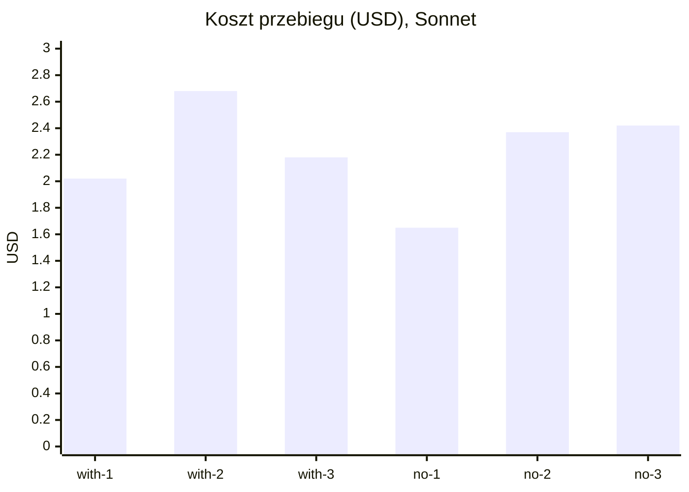

# Pomiar: wpływ chaina AGENTS.md na Claude Code w aid4u (zadanie s01e02)

- Środowisko i skrypty: `bench/aid4u-dox/README.md`; surowe transkrypty w `bench/aid4u-dox/results/`
- Metoda: `claude -p` (pełny Claude Code, tryb nieinteraktywny), model Sonnet, ten sam prompt, świeży snapshot repo bez historii gita i bez śladów rozwiązania; wariant `with-dox` z pełnym chainem `AGENTS.md`, wariant `no-dox` bez żadnego `AGENTS.md`/`CLAUDE.md` w repo. Globalny `~/.claude/CLAUDE.md` w obu.
- Zastrzeżenia: przebieg 1 obu wariantów był na worktree z widoczną historią gita (no-dox-1 zajrzał do `git log --all`, nie użył znalezionego kodu); przebiegi 2 i 3 na snapshotach bez historii. Trzy przebiegi na wariant to za mało na test statystyczny, wariancja Sonneta między przebiegami jest większa niż różnica między wariantami.

## Treść

### Pomiar 1: koszt chaina na wejściu

| Plik | Tokeny (cl100k) |
|---|---|
| `~/.claude/CLAUDE.md` | 708 |
| root `AGENTS.md` | 6 377 |
| `tasks/AGENTS.md` | 4 861 |
| razem do `tasks/s01e02_findhim` | 11 946 |

45% chaina to dwie sekcje: root User Preferences (2 446, narracja o CodeRabbit) i tasks Child DOX Index (2 939, opisy rozwiązanych epizodów). Instrukcje operacyjne obu plików to ok. 3 400 tokenów.

### Pomiar 2: sześć przebiegów

| przebieg | tury | koszt USD | min | out tok | Read | Bash | pytest | AGENTS.md czytane jawnie | flaga |
|---|---|---|---|---|---|---|---|---|---|
| with-dox-1 | 55 | 2,02 | 8,1 | 25 241 | 12 | 34 | 1 | 4 | tak |
| with-dox-2 | 62 | 2,68 | 9,4 | 31 552 | 5 | 48 | 1 | 2 | tak |
| with-dox-3 | 54 | 2,18 | 12,2 | 36 785 | 11 | 33 | 1 | 3 | tak |
| no-dox-1 | 58 | 1,65 | 6,9 | 28 878 | 14 | 40 | 3 | 0 | tak |
| no-dox-2 | 65 | 2,37 | 11,9 | 32 090 | 11 | 41 | 1 | 0 | tak |
| no-dox-3 | 56 | 2,42 | 14,2 | 35 999 | 11 | 41 | 0 | 0 | tak |

| średnia | tury | koszt USD | min | out tok |
|---|---|---|---|---|
| with-dox | 57,0 | 2,29 | 9,9 | 31 193 |
| no-dox | 59,7 | 2,15 | 11,0 | 32 322 |

### Co robili inaczej

| Zachowanie | with-dox (3) | no-dox (3) |
|---|---|---|
| `solution.py` w konwencji repo, `@task`, zgłoszenie przez `run.py solve` | 3/3 | 3/3 |
| Flaga zdobyta | 3/3 | 3/3 |
| Pełny `pytest` na koniec | 3/3 | 1/3 |
| Napisał własne testy | 0/3 | 2/3 |
| DOX pass (utworzył lub uzupełnił `AGENTS.md`) | 3/3 | 0/3 |
| Wynik s01e01 zapisany trwale w `data/output/` | 2/3 | 0/3 |
| Sprawdził `ruff` i `check_dox.py` | 1/3 | 0/3 |
| Rozwiązanie bez LLM w runtime (Haversine) | 3/3 | 2/3 |

Bez DOX agent uczył się konwencji z `s01e01/solution.py`, `s01e05/solution.py`, `core/tasks/base.py` i `run.py`; pierwszy kontakt z hubem po ok. 30 wywołaniach narzędzi wobec ok. 15 z DOX. Ten dłuższy rekonesans kosztował tyle samo, co doczytywanie chaina przy każdej turze w with-dox.

## Ocena

- **Na skuteczność DOX nie ma wpływu.** Sześć na sześć flag, ten sam sposób zgłoszenia, ta sama konwencja pliku. Konwencje repo są wyprowadzalne z kodu, dokładnie tak, jak twierdzi ETH. Wynik zgodny z pracą: pliki kontekstowe nie zmieniają wskaźnika rozwiązań.
- **Na koszt też nie, w tym n.** Średnio +7% w with-dox, przy rozrzucie między przebiegami rzędu 30%. ETH przy setkach zadań widziało +20%; tu jest to niemierzalne. Wniosek praktyczny: przy 12 tys. tokenów chaina koszt wejścia nie jest argumentem ani za, ani przeciw.
- **DOX zmienia to, co agent robi poza zadaniem.** Trzy różnice są systematyczne: with-dox robi DOX pass, zapisuje dane do `data/output/`, odpala pełną bramkę testów. No-dox pisze własne testy jednostkowe, których `tasks/AGENTS.md` nie wymaga. Czyli plik kontekstowy działa jak instrukcja procesowa, nie jak mapa. To jest zgodne z mechanizmem z ETH: agent wykonuje instrukcje sumiennie.
- **Sekcje przeglądowe nie zostały użyte.** Żaden przebieg with-dox nie skorzystał z Child DOX Index ani z narracji o certyfikacie; agent i tak czytał `s01e01/solution.py` i `core/`. 45% chaina to balast bez wykrywalnego efektu, co jest argumentem za wariantem `clean-dox` przyciętym do instrukcji operacyjnych.
- **Co jest warte zachowania w DOX na podstawie tego pomiaru:** reguły, które zmieniły zachowanie (gdzie zapisywać dane, bramka weryfikacji, DOX pass). Co nie: opisy stanu, historia, mapa repo.

### Następny krok

Wariant `clean-dox`: root `AGENTS.md` i `tasks/AGENTS.md` przycięte do Local Contracts, Work Guidance i Verification, bez User Preferences w obecnej formie, bez Child DOX Index z narracją, bez sekcji o certyfikacie. Oczekiwanie: te same zachowania procesowe co with-dox przy chainie ok. 4 tys. tokenów. Jeśli tak wyjdzie, mamy zmierzoną definicję „dobrego AGENTS.md" dla tego repo.
